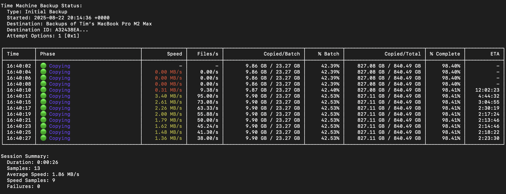
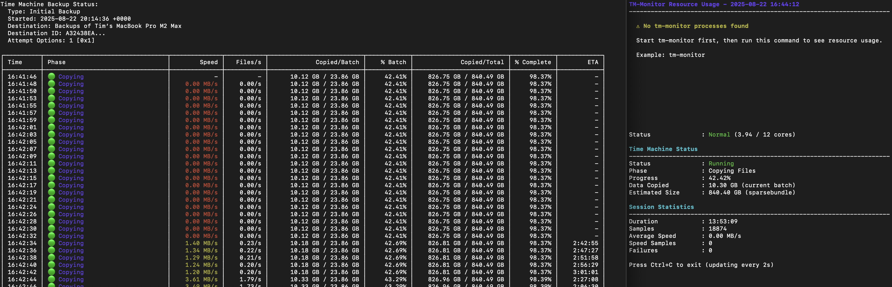

# TM-Monitor

A powerful, real-time Apple Time Machine backup monitor for macOS Sonoma+ with advanced analytics and resource tracking.


## 🤔 Why TM-Monitor?

Apple's Time Machine is great, but it lacks visibility. **You're left wondering:**
- 🐌 Why is my backup taking so long?
- 📊 How fast is data actually transferring?
- 🔮 When will the backup finish?
- 💾 How much data is left to copy?
- 🔥 Is Time Machine using too much CPU?

**TM-Monitor answers all these questions in real-time**, giving you the insights Apple didn't build into macOS.

## 📸 Screenshots






## 🎯 What Makes TM-Monitor Special?

- **Native Apple Integration** - Uses Apple's own `tmutil` for accurate data
- **📈 Advanced Analytics** - 30-second smoothed averages, not jumpy instant values
- **🔋 Low Overhead** - Efficient Python daemon, minimal CPU usage (<1%)
- **🎨 Beautiful TUI** - Color-coded phases, progress bars, emoji indicators
- **📊 Data Export** - CSV logging for historical analysis
- **🔒 Security First** - No eval, no sudo required, safe parsing
- **🚀 Zero Dependencies** - Everything needed is already in macOS

## ✨ Features

### Real-Time Monitoring
- 📊 Live backup progress with percentage complete
- ⚡ Current transfer speed in MB/s or MiB/s
- 📁 Files per second transfer rate
- ⏱️ Accurate ETA with smart calculations
- 🔄 Automatic refresh every 2 seconds

### Advanced Analytics  
- 📈 30-second rolling average for smooth readings
- 🎯 Batch vs. total progress tracking
- 📝 CSV export for historical analysis
- 🔢 Precise 2-decimal formatting throughout

### Resource Management
- 💻 CPU usage monitoring for all TM processes
- 🧠 Memory (RAM) tracking with RSS metrics
- ⚖️ System load impact assessment
- 🚦 Color-coded performance indicators

### Professional Tools
- ⚙️ Configuration file support
- 🎨 Customizable display options
- 🐛 Debug logging for troubleshooting
- 📦 Multiple installation modes

## 📊 TM-Monitor vs. Vanilla Time Machine

| Feature | Time Machine | TM-Monitor |
|---------|---------------|------------|
| Progress Bar | ✅ Basic | ✅ Detailed with % |
| Speed Display | ❌ | ✅ MB/s with smoothing |
| ETA | ❌ | ✅ Smart calculations |
| Files/sec | ❌ | ✅ Real-time |
| CPU Usage | ❌ | ✅ All TM processes |
| Memory Usage | ❌ | ✅ RSS tracking |
| Phase Details | ✅ Limited | ✅ Full phase info |
| CSV Export | ❌ | ✅ For analysis |
| Batch Progress | ❌ | ✅ Current vs Total |

## 🖥️ System Requirements

### Supported Systems
- **macOS**: 14.0 Sonoma or later (for latest Time Machine features)
- **Hardware**: Apple Silicon (M1/M2/M3) or Intel Macs
- **Time Machine**: Must be configured and enabled

### Built with macOS Native Tools
No additional downloads needed! TM-Monitor uses only what Apple provides:
- `tmutil` - Apple's Time Machine utility
- `plutil` - Apple's property list utility  
- Python 3 - Included with macOS
- Bash - macOS default shell

## 📦 Installation

### One-Command Quick Start

```bash
# Clone and install in one command
git clone https://github.com/twickstrom/TimeMachineMonitor.git && \
cd TimeMachineMonitor && \
chmod +x QUICK_START.sh && \
./QUICK_START.sh
```

### Standard Install

```bash
# Clone the repository
git clone https://github.com/twickstrom/TimeMachineMonitor.git
cd TimeMachineMonitor

# Run the installer
./install.sh
```

The installer will:
- ✅ Check all dependencies
- ✅ Detect the best Python 3 version
- ✅ Create necessary directories
- ✅ Install to `~/.local` by default
- ✅ Check if PATH is configured correctly

### Installation Options

```bash
# Standard user installation (default)
./install.sh

# Install to custom location
./install.sh --prefix /opt/tm-monitor

# System-wide installation (requires sudo)
sudo ./install.sh --system

# Development mode (uses symlinks)
./install.sh --dev

# Check dependencies only
./install.sh --check-only
```

### Manual Installation

If you prefer to run directly without installing:

```bash
# Make scripts executable
chmod +x bin/tm-monitor bin/tm-monitor-resources bin/tm-monitor-helper.py

# Run directly from the source directory
./bin/tm-monitor
```

### Uninstallation

```bash
# Run the uninstaller
./uninstall.sh
```

## 📖 Usage

### Basic Monitoring

```bash
# Start monitoring with defaults
tm-monitor

# Monitor with 1-second updates
tm-monitor -i 1

# Use GiB instead of GB
tm-monitor --units 1024

# Enable debug logging
tm-monitor -d

# Log to CSV for analysis
tm-monitor -l

# Disable colors
tm-monitor -c

# Show help
tm-monitor --help
```

### Resource Monitoring

Monitor CPU and memory usage of tm-monitor processes:

```bash
# Check resource usage once
tm-monitor-resources

# Continuous monitoring (updates every 2 seconds)
tm-monitor-resources --watch

# Custom update interval
tm-monitor-resources -w -i 5

# Without colors
tm-monitor-resources -c
```

### Configuration

Create a configuration file to set defaults:

```bash
# Create sample config
tm-monitor --create-config

# Edit the config file
nano ~/.config/tm-monitor/config.conf
```

Configuration options:
- `INTERVAL` - Update interval in seconds (1-300)
- `UNITS` - Size units: 1000 (GB) or 1024 (GiB)
- `SHOW_COLORS` - Enable/disable colored output
- `SHOW_SUMMARY` - Show summary on exit
- `DEBUG` - Enable debug logging
- `CSV_LOG` - Enable CSV logging
- `MAX_FAILURES` - Max tmutil failures before giving up

## 📊 Command Line Options

| Option | Long Form | Description | Default |
|--------|-----------|-------------|---------|
| `-i` | `--interval SECONDS` | Update interval | 2 |
| `-u` | `--units 1000\|1024` | Size units (GB vs GiB) | 1000 |
| `-c` | `--no-colors` | Disable colored output | false |
| `-s` | `--no-summary` | Don't show summary on exit | false |
| `-d` | `--debug` | Enable debug logging | false |
| `-l` | `--csv-log` | Enable CSV logging | false |
| `-C` | `--create-config` | Create sample config file | - |
| `-v` | `--version` | Show version information | - |
| `-h` | `--help` | Show help message | - |

## 🏗️ Architecture

TM-Monitor uses a sophisticated hybrid architecture:

### Core Components

- **Main Monitor** (`tm-monitor`) - Real-time backup tracking
  - Python helper daemon for stateful calculations
  - Speed smoothing over 30-second windows
  - Complex ETA and progress calculations
  - Batch vs total progress tracking

- **Resource Monitor** (`tm-monitor-resources`) - System resource tracking
  - Standalone bash implementation
  - CPU/memory usage monitoring
  - Time Machine status display
  - Session statistics

- **Python Helper** (`tm-monitor-helper.py`) - Calculation daemon
  - Persistent process to avoid startup overhead
  - Stateful speed calculations
  - Ring buffer for speed smoothing
  - Type-hinted for reliability

### Library Modules

- **Core Modules**
  - `version.sh` - Version management
  - `paths.sh` - Centralized path management
  - `colors.sh` - Color definitions and detection
  - `python_check.sh` - Python version detection
  - `dependencies.sh` - Dependency checking

- **Functional Modules**
  - `tmutil.sh` - Time Machine status parsing
  - `state.sh` - Session state management
  - `display.sh` - Terminal UI rendering
  - `logger.sh` - Logging functionality
  - `config.sh` - Configuration handling
  - `process.sh` - Process management
  - `constants.sh` - Application constants
  - `resource_helpers.sh` - Resource monitoring helpers

## 📁 Project Structure

```
tm-monitor/
├── bin/
│   ├── tm-monitor              # Main monitor script
│   ├── tm-monitor-resources    # Resource monitor
│   └── tm-monitor-helper.py    # Python calculation daemon
├── lib/
│   ├── colors.sh               # Color definitions
│   ├── config.sh               # Configuration handling
│   ├── constants.sh            # Application constants
│   ├── dependencies.sh         # Dependency checking
│   ├── display.sh              # UI rendering
│   ├── logger.sh               # Logging functions
│   ├── paths.sh                # Path management
│   ├── process.sh              # Process management
│   ├── python_check.sh         # Python detection
│   ├── resource_helpers.sh     # Resource monitoring helpers
│   ├── state.sh                # State management
│   ├── tmutil.sh               # Time Machine status parsing
│   └── version.sh              # Version management
├── config/
│   └── tm-monitor.conf.example # Sample configuration
├── docs/                       # Documentation
│   ├── SMOOTHING.md            # Smoothing algorithms
│   ├── RESOURCE_METRICS.md     # CPU/Memory metrics
│   └── TMUTIL_STATUS_KEYS.md   # tmutil status reference
├── tests/                      # Test scripts
├── install.sh                  # Professional installer
├── uninstall.sh                # Clean uninstaller
├── LICENSE                     # MIT License
├── CHANGELOG.md                # Version history
├── README.md                   # This file
└── Makefile                    # Make targets
```

## 🔧 Troubleshooting

### Common Issues

**"Time Machine not found" error**
- Ensure Time Machine is configured in System Settings → General → Time Machine

**Numbers showing as "-"**
- This is normal when Time Machine is idle or between backup phases

**Python not found**
- Run `./install.sh --check-only` to diagnose
- The installer will find the best Python version automatically

**Permission denied**
- Make sure scripts are executable: `chmod +x bin/*`

## 🔒 Security

- **No eval usage** - Safe configuration parsing
- **Input validation** - All user input is validated
- **Safe path handling** - Proper quoting and escaping
- **Process isolation** - Helper runs as separate process

## 🚀 Performance

- **Efficient daemon** - Python helper avoids repeated startup
- **Speed smoothing** - 30-second rolling average
- **Minimal subprocess calls** - Caching where appropriate
- **Optimized parsing** - Fast JSON processing

## 🤝 Contributing

Contributions are welcome! Please:

1. Fork the repository
2. Create your feature branch (`git checkout -b feature/AmazingFeature`)
3. Commit your changes (`git commit -m 'Add some AmazingFeature'`)
4. Push to the branch (`git push origin feature/AmazingFeature`)
5. Open a Pull Request

## 📄 License

This project is licensed under the MIT License - see the [LICENSE](LICENSE) file for details.

## 🙏 Acknowledgments

- Inspired by the need for better Time Machine visibility
- Built for the macOS community
- Thanks to all contributors

## 📞 Support

- 🐛 [Report bugs](https://github.com/twickstrom/TimeMachineMonitor/issues)
- 💡 [Request features](https://github.com/twickstrom/TimeMachineMonitor/issues)
- 📖 [Read the docs](https://github.com/twickstrom/TimeMachineMonitor/wiki)
- ⭐ Star this project if you find it useful!

## 🔄 Changelog

For a detailed list of changes and version history, see [CHANGELOG.md](CHANGELOG.md).

---

## ⭐ Star History

If you find TM-Monitor useful, please star ⭐ this repository!

## 📜 License

MIT License - See [LICENSE](LICENSE) file for details.

---

<div align="center">
Made with ❤️ for the Apple macOS community by Tim Wickstrom

**[Report Bug](https://github.com/twickstrom/TimeMachineMonitor/issues) · [Request Feature](https://github.com/twickstrom/TimeMachineMonitor/issues) · [Contribute](CONTRIBUTING.md)**
</div>
